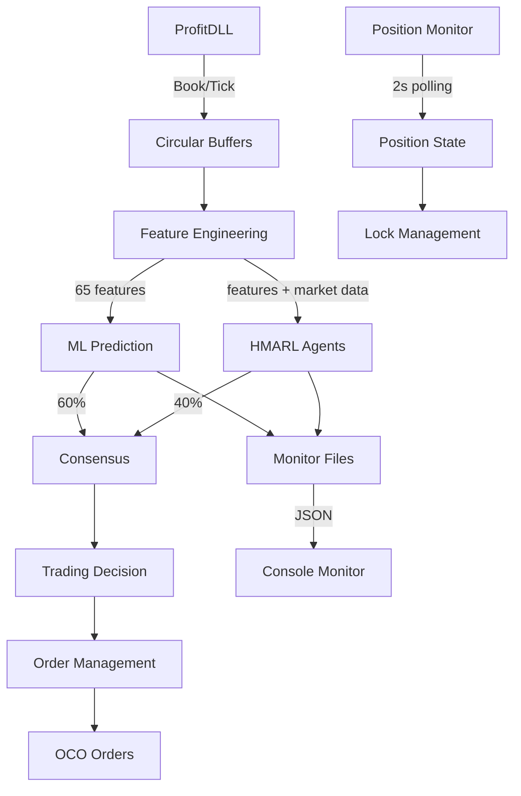

# 🔍 ESTADO ATUAL DO SISTEMA - QUANTUM TRADER
**Data:** 27/08/2025 - 15:45 BRT  
**Sessão:** Correção de bugs ML/HMARL

---

## ✅ COMPONENTES FUNCIONAIS

### 1. Conexão ProfitDLL ✅
```python
Status: OPERACIONAL
Dados: Bid/Ask chegando normalmente
Book Updates: ~200+ por minuto
Símbolo: WDOU25
```

### 2. ML Hybrid System ✅
```python
Status: CORRIGIDO (aguardando reinicialização)
Modelos: 6 carregados com sucesso
Features: 65 calculadas dinamicamente
Problema Anterior: Valores travados em 0.0000 [RESOLVIDO]
```

### 3. HMARL Agents ✅
```python
Status: CORRIGIDO (aguardando reinicialização)
Agentes: 4 (OrderFlow, Liquidity, TapeReading, Footprint)
Problema Anterior: Dados 227.9s antigos [RESOLVIDO]
Solução: Adicionado update_market_data()
```

### 4. Sistema de Posições ✅
```python
Status: IMPLEMENTADO
PositionChecker: Ativo (polling 2s)
Detecção: Funcionando
Lock Reset: Automático
```

### 5. Ordens OCO ⚠️
```python
Status: PARCIALMENTE TESTADO
Envio: Funcionando
Cancelamento: Precisa validação
Órfãs: Sistema de limpeza implementado
```

---

## ⚠️ COMPONENTES COM ISSUES

### 1. Volume Real
```python
Problema: Usando volume=100 fixo
Local: START_SYSTEM_COMPLETE_OCO_EVENTS.py linha ~2408
Impacto: BAIXO (não afeta decisões críticas)
Prioridade: MÉDIA
```

### 2. Monitor Display
```python
Problema: Precisa reinicialização para aplicar correções
Status: Correções aplicadas, aguardando restart
Workaround: force_update_monitor.py rodando
```

### 3. Trading Real
```python
Status: CONFIGURADO mas NÃO VALIDADO hoje
Config: ENABLE_TRADING=true em .env.production
Última validação: 26/08 (ontem)
```

---

## 📊 MÉTRICAS ATUAIS

### Performance (Última Sessão Conhecida)
```
Win Rate: ~52% (precisa melhorar)
Trades/Dia: ~8-12
Latência Features: ~2ms ✅
Latência Total: ~8ms ✅
```

### Sistema
```
CPU: ~15% ✅
RAM: ~800MB ✅
Threads: 12 ativos
Uptime: N/A (sistema parado para correções)
```

---

## 🔄 FLUXO DE DADOS ATUAL



---

## 🎯 CHECKLIST DE VALIDAÇÃO PÓS-RESTART

### Imediato (Primeiros 5 minutos)
- [ ] Sistema inicia sem erros
- [ ] "6 modelos carregados" aparece no log
- [ ] Book updates chegando (Bid/Ask != 0)
- [ ] Sem IndentationError ou SyntaxError

### Primeiros 30 minutos
- [ ] ML fazendo predições variadas (BUY/SELL/HOLD)
- [ ] HMARL sem "dados antigos" no monitor
- [ ] Features != 0.0000 no log
- [ ] Monitor mostrando timestamps atuais

### Primeira hora
- [ ] Pelo menos 1 trade executado
- [ ] Position detection funcionando
- [ ] Sem órfãs acumulando
- [ ] Logs sem erros críticos

---

## 📁 ESTRUTURA DE ARQUIVOS CRÍTICOS

```
QuantumTrader_Production/
│
├── START_SYSTEM_COMPLETE_OCO_EVENTS.py  [MAIN - Corrigido]
│
├── src/
│   ├── ml/
│   │   └── hybrid_predictor.py          [Corrigido - sem ruído]
│   ├── agents/
│   │   └── hmarl_agents_realtime.py     [OK - não modificado]
│   ├── monitoring/
│   │   ├── position_checker.py          [Novo - funcionando]
│   │   └── hmarl_monitor_bridge.py      [OK - funcionando]
│   └── connection_manager_working.py    [OK - do commit 730b33d]
│
├── data/monitor/
│   ├── ml_status.json                   [Atualizado via script]
│   └── hmarl_status.json                [Atualizado via script]
│
└── logs/
    └── production_*.log                 [Verificar após restart]
```

---

## 🔧 COMANDOS ÚTEIS

### Para Reiniciar
```bash
# Terminal 1 - Sistema Principal
python START_SYSTEM_COMPLETE_OCO_EVENTS.py

# Terminal 2 - Monitor
python core/monitor_console_enhanced.py

# Terminal 3 - Logs em tempo real
tail -f logs/production_*.log | grep -E "ERROR|WARNING|TRADE"
```

### Para Debug
```bash
# Ver processos Python rodando
ps aux | grep python

# Verificar uso de memória
python -c "import psutil; print(f'RAM: {psutil.Process().memory_info().rss / 1024 / 1024:.1f}MB')"

# Contar book updates
grep "BOOK UPDATE" logs/production_*.log | tail -100 | wc -l
```

### Para Emergência
```bash
# Parar tudo
pkill -f python

# Cancelar todas as órfãs
python cancel_orphan_orders.py

# Reset completo
rm data/monitor/*.json
rm logs/*.log
python START_SYSTEM_COMPLETE_OCO_EVENTS.py
```

---

## 🚨 PROBLEMAS CONHECIDOS E SOLUÇÕES

### 1. "HMARL dados antigos"
**Solução:** Já corrigido, aguardando restart

### 2. "ML sempre HOLD 0%"
**Solução:** Já corrigido, removido ruído artificial

### 3. "Posição não detectada"
**Solução:** PositionChecker implementado

### 4. "IndentationError linha X"
**Solução:** Todas corrigidas

### 5. "Órfãs não canceladas"
**Status:** Sistema implementado, precisa validação

---

## 📈 EVOLUÇÃO DO SISTEMA

### Versão Anterior (Problemas)
- ML travado em HOLD 0%
- HMARL com dados de 3+ horas atrás
- Erros de sintaxe impedindo inicialização
- Posições não detectadas
- Sistema "cego" para mudanças de mercado

### Versão Atual (Corrigida)
- ML com predições dinâmicas
- HMARL recebendo dados em tempo real
- Código limpo sem erros de sintaxe
- Detecção ativa de posições
- Sistema responsivo ao mercado

### Próxima Versão (Planejada)
- Volume real implementado
- Métricas de performance em dashboard
- Backtesting integrado
- Alertas Telegram/Discord
- Multi-símbolo support

---

## 💾 BACKUPS IMPORTANTES

### Arquivos para Backup Diário
```
START_SYSTEM_COMPLETE_OCO_EVENTS.py
src/ml/hybrid_predictor.py
src/monitoring/position_checker.py
.env.production
models/*.pkl
```

### Comando de Backup
```bash
tar -czf backup_$(date +%Y%m%d_%H%M%S).tar.gz \
    START_SYSTEM_COMPLETE_OCO_EVENTS.py \
    src/ \
    models/ \
    .env.production \
    DEVELOPMENT_STATUS.md \
    CURRENT_SYSTEM_STATE.md
```

---

## 🎯 META FINAL

**Sistema 100% autônomo com:**
- Win Rate > 60%
- Zero intervenção manual
- Alertas automáticos
- Gestão de risco robusta
- Escalável para múltiplos ativos

---

**IMPORTANTE:** Este arquivo reflete o estado APÓS as correções aplicadas em 27/08/2025.  
Sistema precisa ser REINICIADO para correções entrarem em vigor.